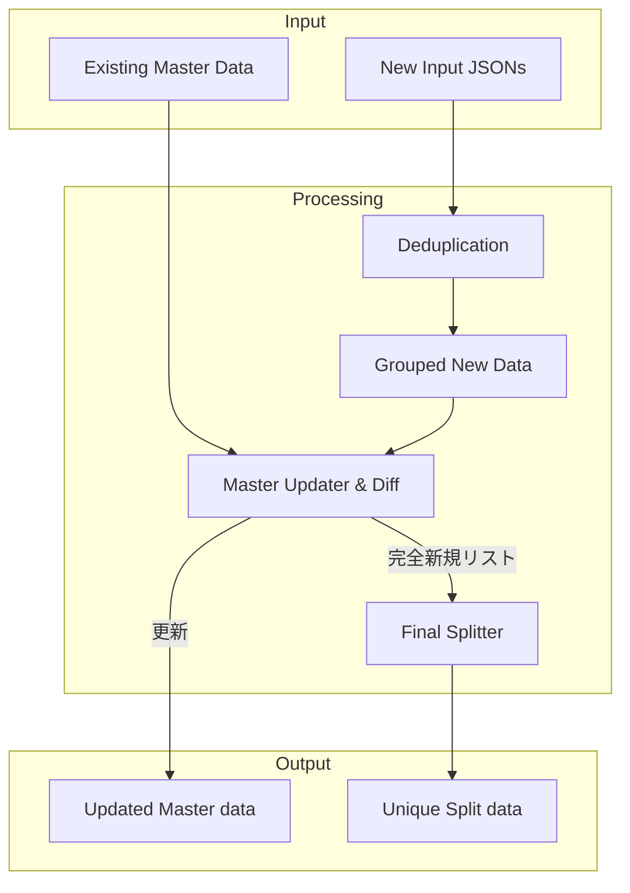

# データ処理モジュール

# 1. 重複排除 (Deduplicator)
## 定義
`processors/deduplicator.py` にて定義

## 概要と仕様
複数のデータから読み込んだ全データから識別キー (`dedup_key`) が重複排除したリストを作成
- 入力データ
  - input フォルダ:  新規データ候補リスト
  - master フォルダ: マスターデータ (全重複排除済みデータ)
- 出力データ
  - output フォルダ: 分割した重複排除した新規データ 
  - master フォルダ: 重複排除した新規データを追記したマスターデータ
- 整合性
  - 最初に読み込まれたデータを優先保持

## アルゴリズム
Python の `set` 型を利用した高速アルゴリズムを採用
1. `unique_data` (`list`) と `seen_ids` (`set`) を用意
2. データを走査し、`seen_ids` にないデータを `unique_data` に追加し、`seen_ids` に登録
3. 存在する場合は無視する

上記により、データ件数が肥大化しても、ある程度無視できる高速化処理の実現している

# マスターデータ更新 (Master Updater)
## 定義
`processors/master_updater.py` にて定義

## 概要と仕様
新規データをグループ化し、存在しないデータは対象グループのマスターデータに統合する
- 入力データ
  - master フォルダ: 特定範囲のマスターデータ (全重複排除済みデータ)
  - 重複排除新規データ
- 出力データ
  - master データ: 特定範囲のマスターデータに完全新規データを追加したデータ
  - ソート済み完全新規データリスト
- 制約
  - 重複排除新規データは対象のグループ制御キー `group_key` がグループ範囲 `group_range` のどの範囲に該当するかのグループ化処理を行う

## 新規マスターデータ作成ロジック
新規マスターデータ作成は以下のステップで実行される
1. 重複排除新規データをグループ制御キー (`group_key`) に該当する値がグループ範囲 (`group_range`) のどこの範囲に該当するかをチェックする
2. 該当する範囲の master データを取得し、グループ範囲に含まれる重複排除新規データと比較する
3. マスターデータに存在しない場合 グループの完全新規データリストを作成する
4. マスターデータに存在する場合、スルーする (ログ出力はするかも？)
5. 比較終了後、マスターデータに完全新規データリストを統合し、ソート・保存を行う
6. グループが存在すれば、ステップ 2. に戻る
7. 各グループの完全新規データリストを全グループ完全新規データリストとして統合する

## 定義
`processors/splitter.py` にて定義

## 概要と仕様
重複排除したデータリストを特定キー (`split_key`) のグループが、別ファイルに分かれないように処理しつつ、設定された件数 (`split_num`) を目安に分割する
- 入力データ
  - ソート済み重複排除したデータリスト
- 制約
  - 同じ特定キー (`split_key`) を持つデータ行は、同じファイルに格納されるようにグループ化してから分割する

## ファイル生成ロジック
分割は 2 ステップで実施される
1. 特定キーのグループ化: 隣接するデータと特定キー (`split_key`) を比較し、同値の場合同じグループとしてまとめる
2. チャンク化: 作成されたグループを設定された件数 (`split_num`) を超える数にまとめ、最終的な出力ファイル単位リストを作成する

上記ロジックにより、ファイルサイズを抑えつつ「関連データが複数ファイルに分散しない」ように、処理している

# 3. ファイル連携のフロー
データ入力から加工処理、そして分割保存までの全体の流れを示す

