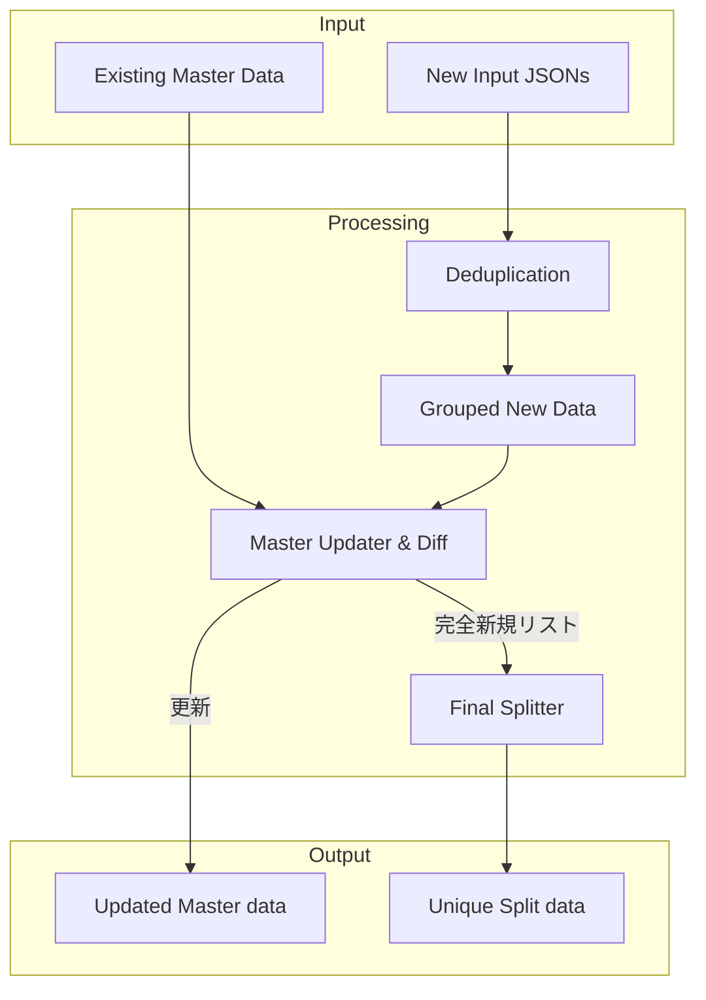

# データ処理モジュール

# 重複排除 (Deduplicator)
## 定義
`processors/deduplicator.py` にて定義

## 概要と仕様
複数のデータから読み込んだ全データから識別キー (`dedup_key`) が重複排除したリストを作成
- 入力データ
  - 重複排除処理対象のデータリスト
  - 重複制御キー
  - 既知のキー集合
- 出力データ
  - 重複を排除した新規データリスト
- 整合性
  - 最初に読み込まれたデータを優先保持
  - 既知のキー集合が存在しない場合、対象のデータリスト内での重複排除を行う

## アルゴリズム
Python の `set` 型を利用した高速アルゴリズムを採用
1. `unique_data` (`list`) と `existing_keys` (`set`) を用意
2. データを走査し、`existing_keys` にないデータを `unique_data` に追加し、`existing_keys` に登録
3. 存在する場合は無視する

上記により、データ件数が肥大化しても、ある程度無視できる高速化処理の実現している

# マスターデータ更新 (Sync Master Data)
## 定義
`processors/sync_master_data.py` にて定義

## 概要と仕様
新規データをグループ化し、存在しないデータは対象グループのマスターデータに統合する
- 入力データ
  - 重複排除済みのグループ化された新規データ
- 出力データ
  - 完全新規データリスト
- 制約
  - 重複排除新規データは対象のグループ制御キー `group_key` がグループ範囲 `group_range` のどの範囲に該当するかのグループ化処理を行う

## 新規マスターデータ作成ロジック
新規マスターデータ作成は以下のステップで実行される
1. 重複排除新規データをグループ制御キー (`group_key`) に該当する値がグループ範囲 (`group_range`) のどこの範囲に該当するかをチェックする
2. 該当する範囲の master データを取得し、グループ範囲に含まれる重複排除新規データと比較する
3. 比較終了後、マスターデータに完全新規データリストを統合し、ソート・保存を行う
   - このとき、完全新規データが存在しない場合は統合・保存処理をSkip
4. 各グループの完全新規データリストを全グループ完全新規データリストとして統合する
5. グループが存在すれば、ステップ 2. に戻る

# データ分割 (Splitter)
## 定義
`processors/splitter.py` にて定義

## 概要と仕様
完全新規データリストを分割キー (`split_key`) のグループが、別ファイルに分かれないように処理しつつ、設定された件数 (`split_num`) を目安に分割する
- 入力データ
  - ソート済み完全新規データリスト
- 制約
  - 同じ特定キー (`split_key`) を持つデータ行は、同じファイルに格納されるようにグループ化してから分割する

## ファイル生成ロジック
分割は 2 ステップで実施される
1. 特定キーのグループ化: 隣接するデータと特定キー (`split_key`) を比較し、同値の場合同じグループとしてまとめる
2. チャンク化: 作成されたグループを設定された件数 (`split_num`) を超える数にまとめ、最終的な出力ファイル単位リストを作成する

上記ロジックにより、ファイルサイズを抑えつつ「関連データが複数ファイルに分散しない」ように、処理している

# ファイル連携のフロー
データ入力から加工処理、そして分割保存までの全体の流れを示す

