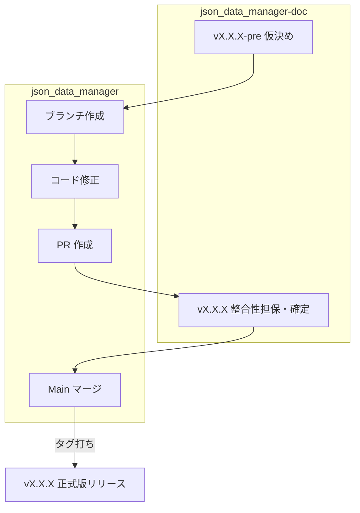

# 運用フロー

## 1. セットアップ
- `uv sync` で依存関係を解決。
- `config/settings.json` で設定値を記載。

## 2. 通常の実行サイクル
1. `data/input/` に新規取得した JSON ファイルを配置。
2. `uv run main.py` を実行。
3. ログを確認し、`data/output/` に分割されたファイルが生成されているか確認。

## 3. 開発フロー
設計と実装の整合性を保つために、以下のステップで作業を進める
現行のバージョンを `v1.1.0` とする
1. 設計の仮決め (例: `v1.2.0-pre1`)
    - 対象: `json_data_manager-doc` 
      - 新規設計・仕様を作成し、仮 tag を打つ
2. コードの実装
    - 対象: `json_data_manager`
      - 用途に応じたリポジトリ prefix を付けてブランチを作成する
        - feature: 機能追加 
        - modify: 機能修正
        - bugfix: 不具合修正
        - refact: リファクタリング
      - 作成ブランチ内で設計に基づき実装する
      - 実装完了後には PR を作成する
3. 設計の整合性担保 (例: `v1.2.0`)
    - 対象: `json_data_manager-doc` 
      - 実装で明らかになった詳細事項をドキュメントに反映させる
      - **完了定義**: ドキュメントの内容が、PR の最新コードと完全に一致していること
4. コードの実装 (例: `v1.2.0`)
    - 対象: `json_data_manager`
      - main ブランチへマージし、その後タグ打ちを行う。

### フロー図

## 4. リリース・管理
- 機能追加とドキュメント更新が完了したタイミングで Git Tag を発行。
  - フォーマット: `vMajor.Minor.Patch(-pre)`
    - 正式版: `v1.1.0`
    - プレリリース: `v1.1.0-pre1`